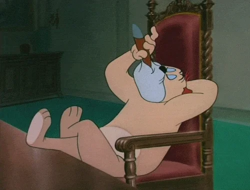
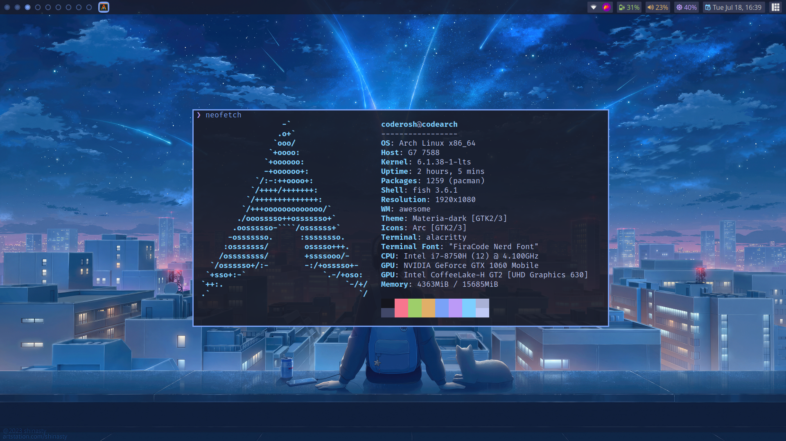
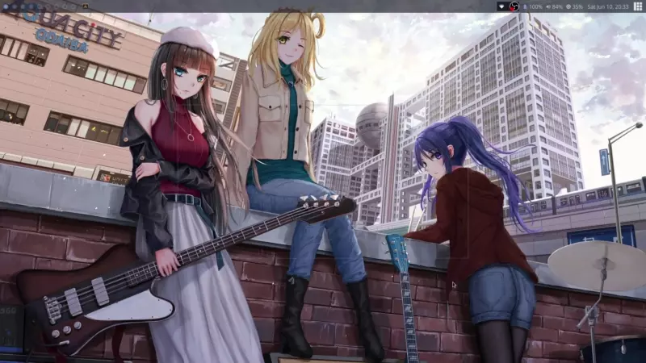
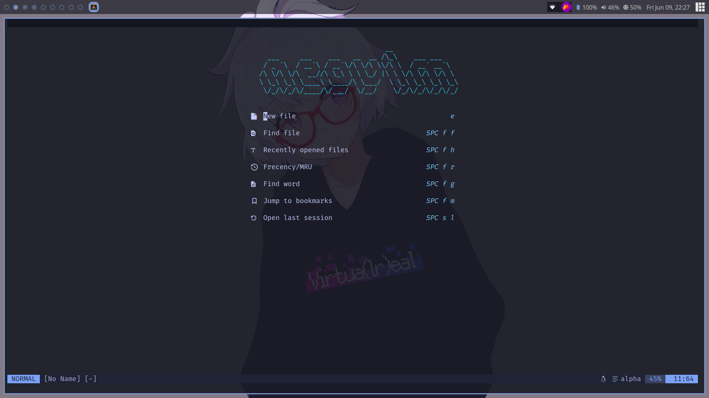
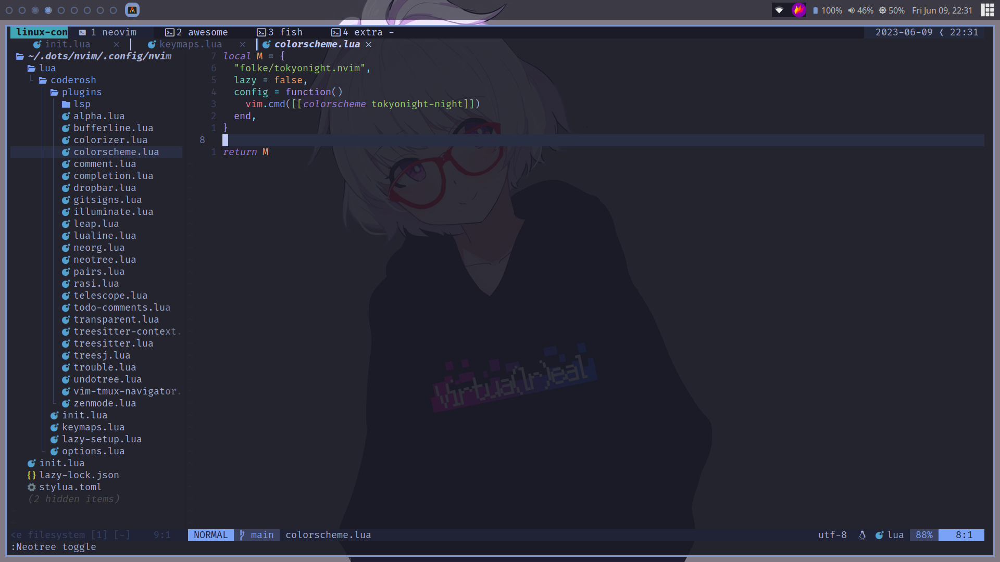
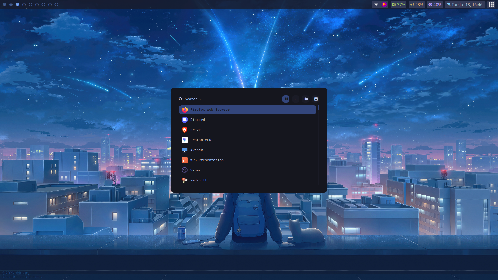
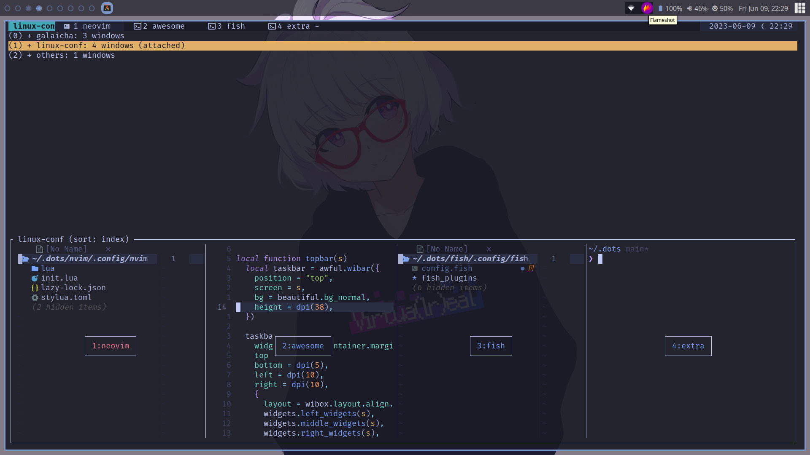
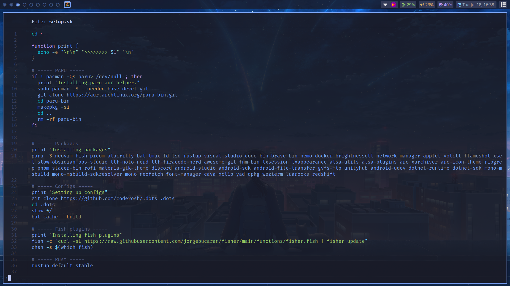

<p align="center">
  
</p>

<h1 align="center">~/.dots</h1>

## 📖 Information

- **WM:** [awesome](https://github.com/awesomeWM/awesome)
- **OS:** [Arch Linux](https://archlinux.org/)
- **Terminal:** [alacritty](https://github.com/alacritty/alacritty)
- **Shell:** [fish](https://github.com/fish-shell/fish-shell)
- **Theme:** [Tokyo Night](https://github.com/folke/tokyonight.nvim)
- **Editor:** [neovim](https://github.com/neovim/neovim)
- **Compositor:** [picom](https://github.com/yshui/picom)
- **Application Launcher:** [rofi](https://github.com/davatorium/rofi)
- **Terminal multiplexer:** [tmux](https://github.com/tmux/tmux)
- **File Manager:** [nemo](https://github.com/linuxmint/nemo)

## 🔧 Installation & Setup

```sh
sh -c "$(curl -sSL https://acharyaroshan.com.np/setup-dots.sh)"
```

## 📷 Screenshots








