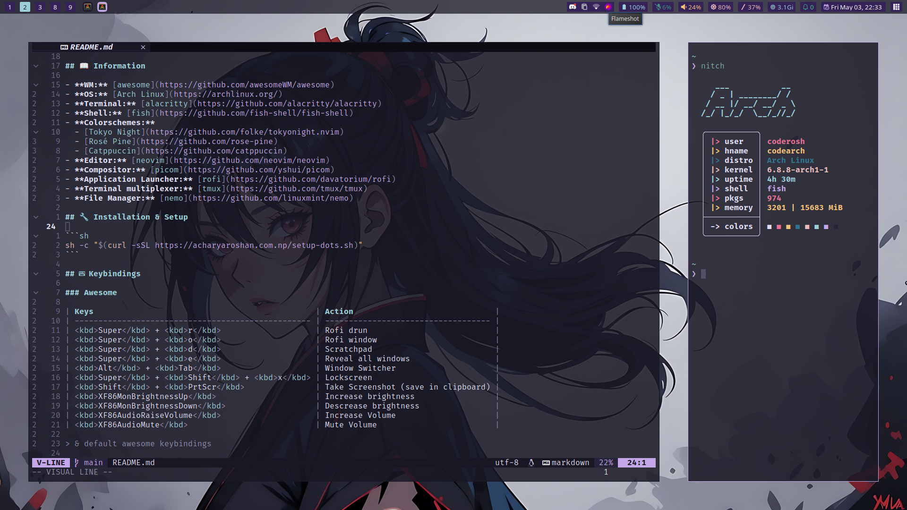

<p align="center">
  
</p>

<h1 align="center">~/.dots</h1>

## 📖 Information

- **WM:** [awesome](https://github.com/awesomeWM/awesome)
- **OS:** [Arch Linux](https://archlinux.org/)
- **Terminal:** [alacritty](https://github.com/alacritty/alacritty)
- **Shell:** [fish](https://github.com/fish-shell/fish-shell)
- **Colorschemes:**
  - [Tokyo Night](https://github.com/folke/tokyonight.nvim)
  - [Rosé Pine](https://github.com/rose-pine)
  - [Catppuccin](https://github.com/catppuccin) 
- **Editor:** [neovim](https://github.com/neovim/neovim)
- **Compositor:** [picom](https://github.com/yshui/picom)
- **Application Launcher:** [rofi](https://github.com/davatorium/rofi)
- **Terminal multiplexer:** [tmux](https://github.com/tmux/tmux)
- **File Manager:** [nemo](https://github.com/linuxmint/nemo)

## 🔧 Installation & Setup

```sh
sh -c "$(curl -sSL https://acharyaroshan.com.np/setup-dots.sh)"
```

## ⌨️ Keybindings

### Awesome

| Keys                                               | Action                              |
| -------------------------------------------------- | ----------------------------------- |
| <kbd>Super</kbd> + <kbd>r</kbd>                    | Rofi drun                           |
| <kbd>Super</kbd> + <kbd>o</kbd>                    | Rofi window                         |
| <kbd>Super</kbd> + <kbd>d</kbd>                    | Scratchpad                          |
| <kbd>Super</kbd> + <kbd>e</kbd>                    | Reveal all windows                  |
| <kbd>Alt</kbd> + <kbd>Tab</kbd>                    | Window Switcher                     |
| <kbd>Super</kbd> + <kbd>Shift</kbd> + <kbd>x</kbd> | Lockscreen                          |
| <kbd>Shift</kbd> + <kbd>PrtScr</kbd>               | Take Screenshot (save in clipboard) |
| <kbd>XF86MonBrightnessUp</kbd>                     | Increase brightness                 |
| <kbd>XF86MonBrightnessDown</kbd>                   | Descrease brightness                |
| <kbd>XF86AudioRaiseVolume</kbd>                    | Increase Volume                     |
| <kbd>XF86AudioMute</kbd>                           | Mute Volume                         |

> & default awesome keybindings

### Tmux

Prefix: <kbd>Ctrl</kbd> + <kbd>a</kbd>

| Keys                                             | Action               |
| ------------------------------------------------ | -------------------- |
| <kbd>Prefix</kbd> + <kbd>\|</kbd>                | Vertical Split       |
| <kbd>Prefix</kbd> + <kbd>\\</kbd>                | Horizontal Split     |
| <kbd>Alt</kbd> + <kbd>Shift</kbd> + <kbd>l</kbd> | Next Window          |
| <kbd>Alt</kbd> + <kbd>Shift</kbd> + <kbd>h</kbd> | Previous Window      |
| <kbd>Alt</kbd> + <kbd>Shift</kbd> + <kbd>h</kbd> | Previous Window      |
| <kbd>Prefix</kbd> + <kbd>h\|j\|k\|l</kbd>        | Resize Pane (repeat) |
| <kbd>Ctrl</kbd> + <kbd>h\|j\|k\|l</kbd>          | Navigate Panes       |

> & default tmux keybindings

## 📷 Screenshots

- Rosepine
  
- Catppuccin
  
- Tokyonight
  

## Scripts

- Change Colorscheme

  ```sh
  ccolorscheme
  ```

- Wifi

  ```sh
  cwifi
  ```
